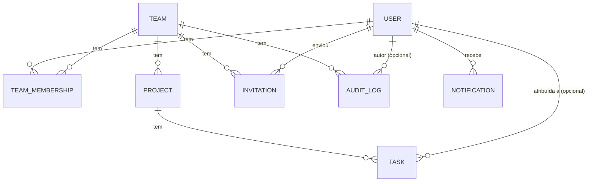
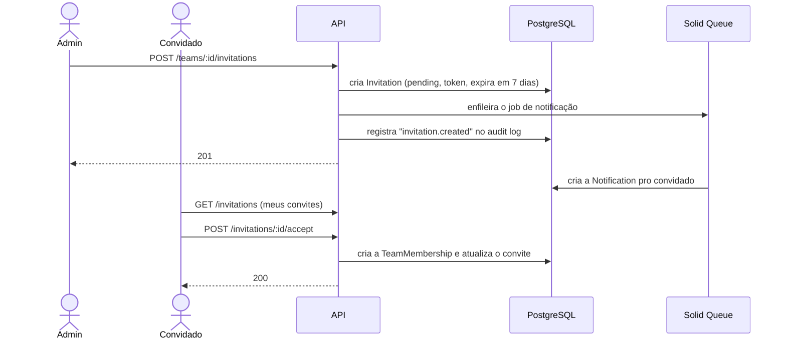

# TeamFlow API


API REST de gestão de times e tarefas. É um projeto de portfólio, então o foco não é ter muita
feature — é mostrar bem algumas coisas que todo backend sério precisa resolver: quem pode fazer
o quê, o que aconteceu e quando, como processar coisas em segundo plano, e como não deixar dois
requests concorrentes quebrarem os dados.

## Destaques técnicos

- **Permissões numa matriz só** (`Permissions::MATRIX`), em vez de cada policy repetir a mesma
  checagem de papel por conta própria.
- **Audit log**: toda ação relevante (criar/editar/apagar time, projeto, tarefa, membro, convite)
  fica registrada com quem fez, o quê e quando.
- **Dois jeitos de entrar num time**: admin adiciona alguém direto, ou convida e espera a pessoa
  aceitar. Fazem sentido em momentos diferentes, então os dois existem.
- **Notificação assíncrona sem Redis**, via Solid Queue — a fila de jobs mora no próprio Postgres.
- **Busca com índice de verdade** (`pg_trgm`), não um `ILIKE` varrendo a tabela inteira.
- **Concorrência tratada, não ignorada**: um índice único garante um só owner por time direto no
  banco, e lock otimista faz uma corrida de aceitar/recusar convite virar um erro claro, não um
  bug silencioso.
- **JWT feito à mão** só pra mostrar que entendo o mecanismo por dentro — não é o que eu usaria
  em produção. Mais em [Decisões de engenharia](#decisões-de-engenharia).
- **174 testes** olhando pra regra de negócio e autorização, não só cobertura de linha.

## Stack

Ruby 3.4 · Rails 8.1 (API-only) · PostgreSQL · Solid Queue · RSpec · Docker · Pundit ·
Blueprinter · Pagy

## Modelo de domínio



Um `User` participa de vários `Team`s através de `TeamMembership` (que carrega o papel:
member/admin/owner). Um `Team` tem `Project`s, que têm `Task`s — cada tarefa pode estar atribuída
a alguém do time. `Invitation` é um convite pendente pra alguém entrar num time; `AuditLog`
registra o que aconteceu; `Notification` é o aviso que chega pra um usuário.

## Modelo de permissões

| Ação                                  | member | admin | owner |
|-----------------------------------------|:------:|:-----:|:-----:|
| Ver time / projetos / tarefas           |   ✅   |  ✅   |  ✅   |
| Criar / editar tarefas                  |   ✅   |  ✅   |  ✅   |
| Ver membros do time                     |   ✅   |  ✅   |  ✅   |
| Criar / editar / apagar projetos        |   ❌   |  ✅   |  ✅   |
| Gerenciar membros e convites            |   ❌   |  ✅   |  ✅   |
| Ver o audit log                         |   ❌   |  ✅   |  ✅   |
| Editar o time                           |   ❌   |  ✅   |  ✅   |
| Apagar o time                           |   ❌   |  ❌   |  ✅   |

Essa tabela é literalmente o código: cada papel herda o que o papel abaixo já pode fazer (owner
inclui tudo do admin, que inclui tudo do member), então cada linha só é declarada uma vez, no
nível onde passa a valer. Quem decide se libera ou não é sempre o
[Pundit](https://github.com/varvet/pundit) — a matriz só tirou a lógica repetida de dentro de
cada policy.

## Um fluxo de ponta a ponta: convidar alguém

Esse é o fluxo que passa por quase tudo que listei acima — autorização, audit log, fila
assíncrona e concorrência — por isso ele ganhou o diagrama:



Se dois `accept`/`decline`/`revoke` chegarem quase juntos pro mesmo convite, o segundo não passa
batido — o lock otimista percebe que o registro mudou e devolve um `409`, em vez de criar um
membro duplicado.

## Decisões de engenharia

- **JWT na mão** em vez de Devise: escolha de portfólio, pra mostrar que entendo hash de senha,
  assinatura e expiração de token. Numa aplicação real eu usaria Devise + devise-jwt.
- **Add direto e convite, os dois**: um admin que já confia na pessoa adiciona na hora; o convite
  existe pra quando quem entra precisa consentir antes.
- **Solid Queue, não Sidekiq**: Sidekiq pede Redis — infra extra num projeto que já é só
  Postgres. E o adapter padrão do Rails perde jobs se o processo cair; Solid Queue não.
- **`pg_trgm`, não um motor de busca**: dá pra buscar substring com índice de verdade sem trazer
  Elasticsearch pra um projeto deste tamanho.
- **Lock otimista só no convite**: é o único lugar do app onde duas pessoas diferentes podem
  disputar o mesmo registro ao mesmo tempo. Mudança de membership é sempre um admin agindo
  sozinho — não tem a mesma corrida ali, então não precisa do mesmo cuidado.
- **Um owner por time, garantido duas vezes**: validação pra dar uma mensagem de erro decente, e
  um índice único no banco pra garantir de verdade, sem brecha de corrida entre checar e inserir.
- **Erro sempre no mesmo formato**, com um `code` fixo por tipo de problema — inclusive o `409`
  novo, específico pra convite processado em cima da hora.

## Como rodar

### Com Docker (mais fácil)

```bash
cp .env.example .env
docker compose up -d --build
docker compose exec web bin/rails db:setup
```

Sobe o Postgres, o Rails e o worker do Solid Queue junto. A API fica em `localhost:3000`.

```bash
docker compose exec web bundle exec rspec
docker compose down          # com -v se quiser limpar o banco também
```

### Sem Docker

```bash
bundle install
cp .env.example .env
bin/rails db:setup
bin/rails server
bin/jobs        # em outro terminal, senão as notificações ficam paradas na fila
```

Login de teste depois de popular o banco: `ana@teamflow.dev` / `password123`.

## Testes

```bash
bundle exec rspec
bin/rubocop
bin/brakeman
```

Organizados por camada: `spec/models` cobre regra de negócio (um owner por time, o ciclo do
convite, a corrida de double-accept), `spec/policies` cobre a matriz de permissões, e
`spec/requests` testa cada endpoint de ponta a ponta — autorização, filtros, busca, paginação e o
formato de erro.

## Referência da API

Tudo em `/api/v1`, com `Authorization: Bearer <token>` (exceto signup/login).

Nas linhas com mais de uma rota, o "quem acessa" segue a mesma ordem — primeira rota com a
primeira permissão, e assim por diante.

| Recurso | Rotas | Quem acessa |
|---|---|---|
| Auth | `POST /signup`, `POST /login` | qualquer um |
| Times (listar/criar) | `GET`, `POST /teams` | qualquer usuário autenticado |
| Times (um time) | `GET`, `PATCH`, `DELETE /teams/:id` | membros ⋅ admin+owner ⋅ owner |
| Membros do time | `GET /teams/:id/memberships` | membros |
| Membros do time (gerenciar) | `POST/PATCH/DELETE .../memberships(/:id)` | admin+owner |
| Convites (do time) | `GET/POST/DELETE /teams/:id/invitations(/:id)` | admin+owner |
| Meus convites | `GET /invitations`, `POST .../accept\|decline` | só o convidado |
| Audit log | `GET /teams/:id/audit_logs` | admin+owner |
| Notificações | `GET`, `PATCH .../:id/read`, `POST .../read_all` | dono da notificação |
| Projetos (listar/criar) | `GET`, `POST /teams/:id/projects` | membros ⋅ admin+owner |
| Projetos (um projeto) | `GET`, `PATCH`, `DELETE /projects/:id` | membros ⋅ admin+owner ⋅ admin+owner |
| Tarefas (listar/criar) | `GET`, `POST /projects/:id/tasks` | membros |
| Tarefas (uma tarefa) | `GET`, `PATCH`, `DELETE /tasks/:id` | membros |

Detalhes que não cabem na tabela: convite só pra e-mail com conta existente (`422` se não tiver);
`role` de convite/membership nunca aceita `owner`; tarefas e projetos aceitam `?q=` (busca por
título/nome), tarefas também aceitam `?sort=` + `?direction=` e os filtros
`?status=`/`?priority=`/`?assignee_id=`.

Toda lista paginada responde assim:

```json
{ "tasks": [ { "...": "..." } ], "meta": { "page": 1, "items": 20, "count": 7, "pages": 1 } }
```

## Variáveis de ambiente

Ver `.env.example` — `DATABASE_*` (conexão com o Postgres), `JWT_SECRET_KEY` (assina os tokens),
`CORS_ORIGINS` e `JOB_CONCURRENCY` (workers do Solid Queue, padrão 1).

## Próximos passos

- Casar convite com conta que ainda não existe (hoje precisa já estar cadastrada).
- Notificação por e-mail de verdade, já que a fila assíncrona já está pronta.
- Refresh token / revogação no JWT.
- Soft delete em vez de exclusão em cascata.
- Rate limiting no login/signup.

## Autora

**Ana Morais** — [LinkedIn](https://www.linkedin.com/in/ana-morais-dev/)
