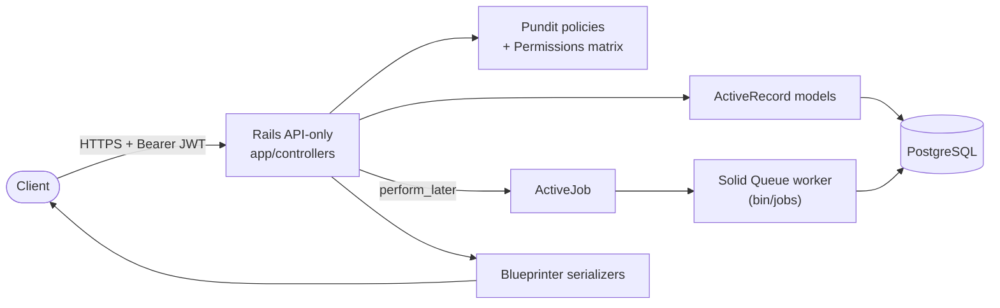
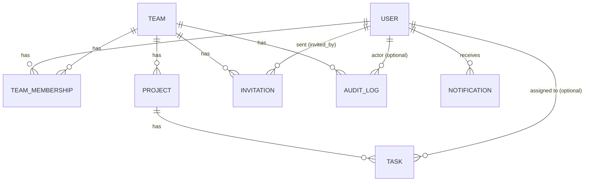
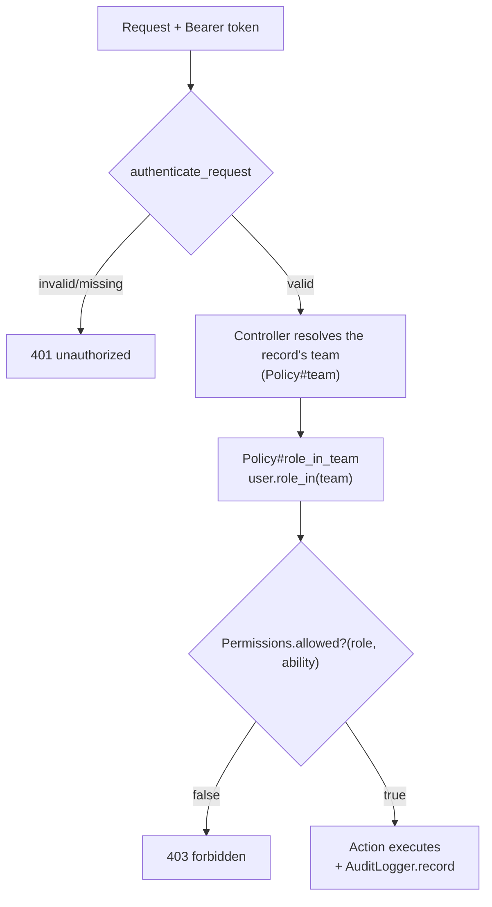
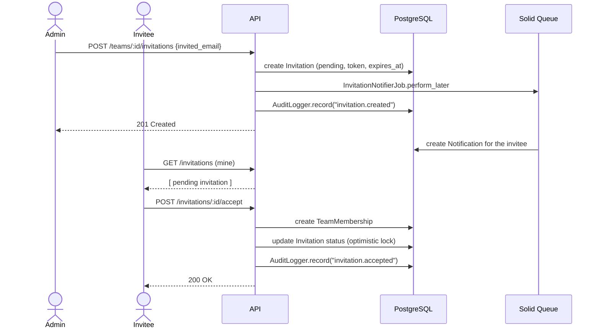

# TeamFlow API


A REST API for team and task management, built as a portfolio project to demonstrate backend
engineering practices with Ruby on Rails: authentication, a centralized role-based permission
matrix, an audit trail, an opt-in invite flow, Postgres-backed async notifications, efficient
search/pagination, and concurrency-safe data integrity — all backed by a business-rule-focused
test suite.

## Technical Highlights

Built for backend júnior/estágio applications. What it's meant to demonstrate:

- **Centralized resource × action permission matrix** — every policy resolves access through one
  `Permissions` module (`app/policies/permissions.rb`) instead of each policy re-implementing
  `role.in?(%w[admin owner])` ad hoc. The matrix is covered directly by its own spec, independent
  of any single policy. See [Permission model](#permission-model).
- **Audit trail** — every mutating action on a team's resources (teams, projects, tasks,
  memberships, invitations) is recorded with actor, action and metadata, queryable via
  `GET /teams/:id/audit_logs` (admin/owner only).
- **Two membership flows, on purpose** — an instant direct-add for admins who already know the
  person (`POST /teams/:id/memberships`), and an opt-in invite (`Invitation`, token + 7-day
  expiry, accept/decline) for consent-based joins. Why both exist is in
  [Engineering decisions](#engineering-decisions).
- **Async processing without Redis** — Solid Queue (Postgres-backed ActiveJob) dispatches
  notifications off the request cycle; `bin/jobs` runs the worker alongside the server.
- **Efficient search** — `pg_trgm` GIN indexes back substring search on task titles and project
  names, instead of an unindexed `ILIKE` full scan.
- **Concurrency-safe by design** — a partial unique index guarantees one owner per team at the
  database level (not just app validation), and optimistic locking on `Invitation` turns a
  concurrent double-accept into a clean `409`, not a silent duplicate or a crash.
- **Authentication built from scratch** — JWT encode/decode implemented by hand rather than
  plugging in Devise, to show the mechanics of password hashing, token signing and expiration
  are understood, not just used. The trade-off is spelled out in
  [Engineering decisions](#engineering-decisions).
- **Automated testing focused on business rules** — 174 RSpec examples across models, policies
  and full HTTP request specs, including the permission matrix, the invitation accept/decline
  race, and the audit trail — not just line coverage. RuboCop and Brakeman both run clean (see
  [Running tests](#running-tests)).
- **Containerized development** — `docker compose up` brings up the app, Postgres and the Solid
  Queue worker together.
- **Trade-offs are documented, not hidden** — every non-obvious architectural choice is written
  down in [Engineering decisions](#engineering-decisions).

## Table of contents

- [Stack](#stack)
- [Architecture overview](#architecture-overview)
- [Domain model](#domain-model)
- [Permission model](#permission-model)
- [Request lifecycle: inviting a teammate](#request-lifecycle-inviting-a-teammate)
- [Engineering decisions](#engineering-decisions)
- [Getting started](#getting-started)
- [Running tests](#running-tests)
- [API reference](#api-reference)
- [Environment variables](#environment-variables)
- [Possible next steps](#possible-next-steps)

## Stack

- Ruby 3.4 / Rails 8.1 (API-only mode)
- PostgreSQL
- Solid Queue (Postgres-backed background jobs, no Redis)
- RSpec (model, policy and request specs)
- Docker / Docker Compose for local development
- Pundit (authorization), Blueprinter (serialization), Pagy (pagination)

## Architecture overview



The API process and the `bin/jobs` worker process are two separate OS processes (see
`docker-compose.yml`), but they share the same Postgres database — Solid Queue's tables live
alongside the app's own tables, so there's no second datastore to operate.

## Domain model



- **User** — has a name, a unique email and a password (via `has_secure_password`).
- **Team** — has many members through `TeamMembership`, has many `Project`s.
- **TeamMembership** — join model between `User` and `Team`, carries the `role`
  (`member`, `admin`, `owner`). A team has exactly one `owner`, assigned automatically to
  whoever creates the team; ownership is not transferable through the API. Enforced by both an
  app-level validation and a partial unique index (`team_id` unique `where role = 2`).
- **Project** — belongs to a `Team`, has many `Task`s.
- **Task** — belongs to a `Project`, has a title, description, `status`
  (`pending`/`in_progress`/`done`), `priority` (`low`/`medium`/`high`), an optional `due_date`
  and an optional `assignee`, who must belong to the project's team.
- **Invitation** — belongs to a `Team`, carries `invited_email`, `role` (`member`/`admin`, never
  `owner`), `status` (`pending`/`accepted`/`declined`/`revoked`/`expired`), a unique `token` and
  `expires_at`. Optimistically locked (`lock_version`) — see
  [Engineering decisions](#engineering-decisions).
- **AuditLog** — belongs to a `Team` and, optionally, the `User` who acted; polymorphic
  `auditable` (the record affected) plus a free-form `metadata` JSON column.
- **Notification** — belongs to a `User` (the recipient); `category`, `title`, `body`, `payload`
  (JSON) and `read_at`. Created asynchronously by ActiveJob workers.

## Permission model

| Ability                                  | member | admin | owner |
|-------------------------------------------|:------:|:-----:|:-----:|
| View team / projects / tasks              |   ✅   |  ✅   |  ✅   |
| Create / edit tasks                       |   ✅   |  ✅   |  ✅   |
| View team memberships                     |   ✅   |  ✅   |  ✅   |
| Create / edit / delete projects           |   ❌   |  ✅   |  ✅   |
| Add / remove / promote members (direct)   |   ❌   |  ✅   |  ✅   |
| Invite / revoke invitations                |   ❌   |  ✅   |  ✅   |
| View the audit log                        |   ❌   |  ✅   |  ✅   |
| Update the team                           |   ❌   |  ✅   |  ✅   |
| Delete the team                           |   ❌   |  ❌   |  ✅   |

This table *is* `Permissions::MATRIX` (`app/policies/permissions.rb`) — each role's ability set is
built by composing the tier below it (`owner` ⊇ `admin` ⊇ `member`), so a capability is only
declared once, at the tier where it's first granted:

```ruby
MEMBER_ABILITIES = %i[team_view project_view task_view task_manage membership_view]
ADMIN_ABILITIES  = MEMBER_ABILITIES + %i[team_update project_manage membership_manage invitation_manage audit_log_view]
OWNER_ABILITIES  = ADMIN_ABILITIES + %i[team_destroy]
```

Every policy (`app/policies/*_policy.rb`) resolves the caller's role via `User#role_in(team)`,
then asks `Permissions.allowed?(role, ability)`. Authorization itself still runs through
[Pundit](https://github.com/varvet/pundit) — the matrix just replaces what used to be scattered,
duplicated `role.in?(%w[admin owner])` checks with one source of truth, covered by its own spec
(`spec/policies/permissions_spec.rb`) independent of any single resource:



## Request lifecycle: inviting a teammate

Chosen because it's the one flow that touches almost every differentiator at once: authorization,
the audit trail, async notifications and optimistic-locking concurrency safety.



If a second `accept`/`decline`/`revoke` races in on the same invitation before the first one
commits, the `lock_version` mismatch raises `ActiveRecord::StaleObjectError`, which the controller
maps to `409 conflict` instead of silently creating a duplicate membership or corrupting state.

## Engineering decisions

- **Authentication is a hand-rolled JWT implementation** (`app/lib/json_web_token.rb` +
  `ApplicationController#authenticate_request`), built intentionally instead of using
  Devise/devise-jwt. This is a deliberate portfolio choice to demonstrate understanding of how
  token-based auth works under the hood (password hashing with bcrypt, token signing,
  expiration). **In a production application this would typically be replaced by a maintained
  solution** such as Devise + devise-jwt, which adds things like refresh tokens, revocation and
  battle-tested edge-case handling that this implementation does not attempt to cover.
- **Two ways to join a team, kept deliberately separate.** `POST
  /teams/:team_id/memberships` still adds an *existing* user straight away — no consent step,
  useful when an admin already knows and trusts the person. `Invitation` is the newer, opt-in
  path: the invited person has to actively accept before a membership is created. Neither
  replaces the other; they serve different trust assumptions, so both stayed in the API rather
  than picking one.
- **Invitations only target existing accounts** (looked up by email at creation time; `422` if
  none exists) rather than accepting an arbitrary email and matching it against a future signup.
  That signup-matching flow is real product complexity (what happens if the account is deleted
  before signup? re-invited with a different role?) that wasn't worth taking on for a portfolio
  project — see [Possible next steps](#possible-next-steps).
- **Solid Queue over Sidekiq/`:async`** for background jobs. Sidekiq needs Redis — another moving
  part to run and operate for a project that's otherwise 100% Postgres. The Rails default
  `:async` adapter needs nothing extra, but it's in-process and non-durable: jobs are lost if the
  process restarts. Solid Queue is Rails 8's own answer — durable, Postgres-backed, no new
  datastore — so notifications survive a redeploy without adding infrastructure.
- **`pg_trgm` + a GIN index, not a search engine.** Task/project search is a simple `ILIKE`, but
  backed by a trigram index instead of an unindexed full scan — enough to demonstrate query
  performance awareness at the data volumes this project actually has. A real product at scale
  would reach for Elasticsearch or Postgres full-text search (`tsvector`) instead.
- **Optimistic locking (`lock_version`) lives on `Invitation` specifically, not everywhere.**
  It's the one model in this app where two different actors can legitimately race to mutate the
  *same row's* state at the same time (accept vs. decline vs. revoke). Direct membership/role
  changes are always a single admin acting alone, so there's no equivalent race to guard there —
  adding locking everywhere "just in case" would be solving a problem that doesn't exist yet.
- **The one-owner-per-team rule is enforced twice, deliberately**: an app-level validation
  (`TeamMembership#only_one_owner_per_team`) for a clean error message, and a partial unique index
  (`team_id` unique `where role = 2`) as the actual guarantee. The app check alone has a
  check-then-insert race window under concurrent requests; the index closes it.
- **`AuditLogger.record` is called explicitly from each controller action**, not via a model
  callback. A few extra lines per action, but it means the audit trail is never a surprise — read
  any controller action and you can see exactly what gets logged and with what metadata, instead
  of chasing it through `after_*_commit` hooks on the model.
- **Notifications are in-app rows, not real emails.** Sending actual email would mean picking a
  delivery provider and its own config/credentials — out of scope for what this feature is meant
  to demonstrate (decoupling side effects from the request cycle via a job queue). A `Notification`
  row is the observable proof the async path ran.
- **Errors** are always returned in the same envelope, handled centrally in
  `ApplicationController`:
  ```json
  { "error": { "code": "validation_failed", "message": "Validation failed", "details": { "title": ["can't be blank"] } } }
  ```
  `details` is omitted when there's nothing more specific than the message. `409 conflict` was
  added alongside the existing codes specifically for the invitation race case above.
- **Pagination** uses [Pagy](https://github.com/ddnexus/pagy), pinned to the `~> 9.4` line — the
  latest Pagy major release (43.x) is a from-scratch rewrite of the gem's API; 9.x is the last
  version with the classic, widely-documented `Pagy::Backend` API.

## Getting started

### Option A — Docker (recommended)

Requires Docker and Docker Compose.

```bash
cp .env.example .env        # defaults already work as-is
docker compose build
docker compose up -d
docker compose exec web bin/rails db:setup   # create, migrate and seed the database
```

This brings up three containers: `db` (Postgres), `web` (the Rails server) and `jobs` (the Solid
Queue worker that processes async notifications). The API is now available at
`http://localhost:3000`. Check `http://localhost:3000/up` for a health check.

Useful commands:

```bash
docker compose logs -f web jobs     # tail app + worker logs
docker compose exec web bin/rails console
docker compose exec web bundle exec rspec
docker compose down                 # stop containers (add -v to also wipe the db volume)
```

### Option B — Local Ruby

Requires Ruby 3.4 (see `.ruby-version`) and a running PostgreSQL instance.

```bash
bundle install
cp .env.example .env                       # adjust DATABASE_* if not using the defaults below
bin/rails db:setup                         # create, migrate and seed the database
bin/rails server
bin/jobs                                   # in a second terminal — runs the Solid Queue worker
```

By default the app connects to `postgres:postgres@localhost:5432`. If you don't have Postgres
installed locally, you can still just run `docker compose up -d db` to start only the database
container and point the local Rails server at `localhost:5432`. `bin/jobs` is only needed to
actually process async notifications — the API itself works without it, requests just won't
produce `Notification` rows until a worker picks up the queued jobs.

### Sample login (after seeding)

```
email: ana@teamflow.dev
password: password123
```

## Running tests

```bash
bundle exec rspec        # or: docker compose exec web bundle exec rspec
bin/rubocop               # style
bin/brakeman               # static security scan
```

Job specs (and any request spec touching a job) run against ActiveJob's `:test` adapter, which
RSpec enables automatically — `bin/jobs` isn't needed to run the suite, only to see notifications
actually get created when using the running app.

Tests are organized as:

- `spec/models` — validations, associations, enums, business rules (one owner per team, the
  invitation accept/decline/expiry state machine, the concurrent double-accept race).
- `spec/policies` — the full member/admin/owner permission matrix per resource, plus
  `permissions_spec.rb`, which tests `Permissions::MATRIX` directly.
- `spec/requests` — end-to-end HTTP specs per endpoint: happy paths, authorization boundaries,
  filters, search, sorting, pagination, async job enqueuing and the error envelope.
- `spec/factories` — FactoryBot factories used across all of the above.

## API reference

All endpoints are under `/api/v1`. Except for signup/login, every request requires:

```
Authorization: Bearer <token>
```

### Auth

| Method | Path             | Description                          |
|--------|------------------|---------------------------------------|
| POST   | `/signup`        | Create an account, returns a token    |
| POST   | `/login`         | Authenticate, returns a token         |

<details>
<summary>Examples</summary>

```bash
curl -X POST localhost:3000/api/v1/signup \
  -H "Content-Type: application/json" \
  -d '{"user":{"name":"Ana","email":"ana@example.com","password":"password123"}}'

curl -X POST localhost:3000/api/v1/login \
  -H "Content-Type: application/json" \
  -d '{"session":{"email":"ana@example.com","password":"password123"}}'
```
</details>

### Teams

| Method | Path                 | Who                    |
|--------|----------------------|-------------------------|
| GET    | `/teams`             | any authenticated user (returns their own teams, paginated) |
| POST   | `/teams`             | any authenticated user (creator becomes owner) |
| GET    | `/teams/:id`         | team members |
| PATCH  | `/teams/:id`         | admin/owner |
| DELETE | `/teams/:id`         | owner |

### Team memberships (direct-add)

| Method | Path                                      | Who |
|--------|--------------------------------------------|-----|
| GET    | `/teams/:team_id/memberships`               | team members — `?role=member\|admin\|owner` |
| POST   | `/teams/:team_id/memberships`               | admin/owner — body: `{ "membership": { "user_id": 2, "role": "member" } }` |
| PATCH  | `/teams/:team_id/memberships/:id`           | admin/owner — change `role` to `member`/`admin` (not `owner`) |
| DELETE | `/teams/:team_id/memberships/:id`           | admin/owner (cannot remove the owner) |

Adds an existing user immediately, no acceptance step. See **Invitations** below for the opt-in
alternative.

### Invitations (opt-in join flow)

| Method | Path                                   | Who |
|--------|------------------------------------------|-----|
| GET    | `/teams/:team_id/invitations`            | admin/owner — pending invitations for the team, paginated |
| POST   | `/teams/:team_id/invitations`            | admin/owner — body: `{ "invitation": { "invited_email": "diego@teamflow.dev", "role": "member" } }` |
| DELETE | `/teams/:team_id/invitations/:id`        | admin/owner — revokes a pending invitation |
| GET    | `/invitations`                           | any authenticated user — their own pending invitations, matched by email |
| POST   | `/invitations/:id/accept`                | the invited user only |
| POST   | `/invitations/:id/decline`               | the invited user only |

Notes: `invited_email` must belong to an existing account (`422` otherwise); `role` can be
`member` or `admin`, never `owner`; a team can only have one pending invitation per email at a
time; a stale accept/decline/revoke on an already-processed invitation returns `409 conflict`.

```bash
curl -X POST localhost:3000/api/v1/teams/1/invitations \
  -H "Authorization: Bearer <token>" -H "Content-Type: application/json" \
  -d '{"invitation":{"invited_email":"diego@teamflow.dev","role":"member"}}'
```

### Audit logs

| Method | Path                              | Who |
|--------|------------------------------------|-----|
| GET    | `/teams/:team_id/audit_logs`        | admin/owner — paginated, `?event=task.created` and `?user_id=` filters |

`event` filters on the log's `action` column (e.g. `task.created`, `membership.role_changed`,
`invitation.accepted`) — named `event`, not `action`, because `:action` is a reserved routing key
that Rails always populates with the current controller action name.

### Notifications

| Method | Path                              | Who |
|--------|------------------------------------|-----|
| GET    | `/notifications`                    | mine — paginated, `?unread=true` filter |
| PATCH  | `/notifications/:id/read`           | mine only |
| POST   | `/notifications/read_all`           | mine — marks every unread notification read |

Created asynchronously (via Solid Queue) when: you're invited to a team, your role on a team
changes, or a task is assigned to you.

### Projects

| Method | Path                              | Who |
|--------|------------------------------------|-----|
| GET    | `/teams/:team_id/projects`          | team members, paginated, `?q=` searches `name` |
| POST   | `/teams/:team_id/projects`          | admin/owner |
| GET    | `/projects/:id`                     | team members |
| PATCH  | `/projects/:id`                     | admin/owner |
| DELETE | `/projects/:id`                     | admin/owner |

### Tasks

| Method | Path                                | Who |
|--------|--------------------------------------|-----|
| GET    | `/projects/:project_id/tasks`         | team members, paginated, filterable/searchable/sortable |
| POST   | `/projects/:project_id/tasks`         | any team member |
| GET    | `/tasks/:id`                          | team members |
| PATCH  | `/tasks/:id`                          | any team member |
| DELETE | `/tasks/:id`                          | any team member |

Filters on `GET /projects/:project_id/tasks` (combinable, all optional):

```
?status=pending|in_progress|done
&priority=low|medium|high
&assignee_id=<user_id>
&q=<substring of title>            # ILIKE, backed by a pg_trgm GIN index
&sort=created_at|due_date|priority|title
&direction=asc|desc                # defaults to asc
&page=<n>
```

```bash
curl "localhost:3000/api/v1/projects/1/tasks?status=pending&priority=high&sort=due_date&direction=asc" \
  -H "Authorization: Bearer <token>"
```

Paginated list responses share this shape:

```json
{
  "tasks": [ { "...": "..." } ],
  "meta": { "page": 1, "items": 20, "count": 7, "pages": 1 }
}
```

## Environment variables

See `.env.example`. In short:

| Variable | Purpose |
|----------|---------|
| `DATABASE_HOST`, `DATABASE_PORT`, `DATABASE_USERNAME`, `DATABASE_PASSWORD` | Postgres connection |
| `JWT_SECRET_KEY` | Secret used to sign auth tokens (falls back to the Rails credentials secret key base if unset) |
| `CORS_ORIGINS` | Comma-separated allowed origins for CORS (defaults to `*` for local development) |
| `JOB_CONCURRENCY` | Number of Solid Queue worker processes (`config/queue.yml`); defaults to `1` |

## Possible next steps

- Matching invitations to future signups by email, instead of requiring the account to already
  exist at invite time.
- Delivering notifications by real email (ActionMailer) in addition to the in-app `Notification`
  row, now that the async plumbing (Solid Queue) is already in place.
- Refresh tokens / token revocation for the JWT flow.
- Soft deletes for teams/projects/tasks instead of hard cascade deletes.
- Rate limiting (e.g. `rack-attack`) on the auth endpoints.

## Author

**Ana Morais** — [LinkedIn](https://www.linkedin.com/in/ana-morais-dev/)
